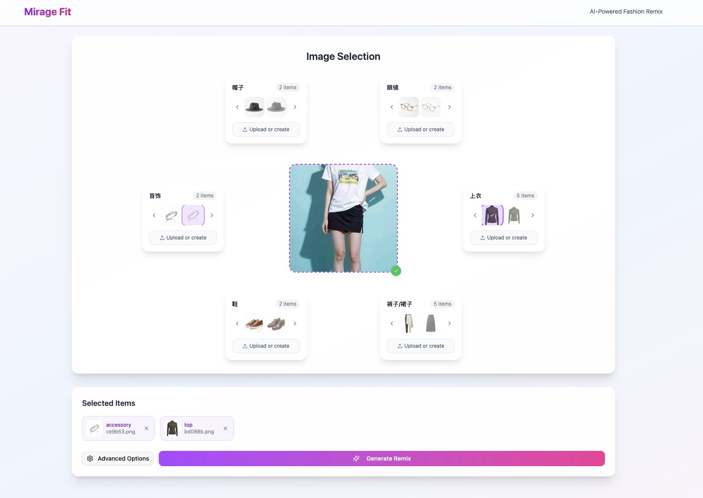

# Mirage Fit


[](https://crates.io/crates/mirage-fit)
[](https://docs.rs/mirage-fit)
[](https://opensource.org/licenses/MIT)

A modern AI-powered fashion remix application that allows users to virtually try on different clothing items and accessories using Google's Gemini AI. Upload your photo and mix-and-match various fashion items to create your perfect style.



## Features

- 🎨 **AI-Powered Fashion Remixing**: Leverage Google Gemini AI to seamlessly blend clothing items with your photos
- 👔 **Multiple Fashion Categories**: Support for tops, bottoms, dresses, shoes, bags, and accessories
- 📸 **Easy Photo Upload**: Simple drag-and-drop interface for uploading your photos
- 🎯 **Smart Item Generation**: AI generates fashion items based on your style preferences
- 🔄 **Real-time Processing**: Fast image processing and remixing
- 🎨 **Intuitive UI**: Modern, responsive web interface built with React and TypeScript
- 🚀 **High Performance**: Built with Rust for blazing-fast backend performance

## Technology Stack

- **Backend**: Rust with Axum web framework
- **AI Integration**: Google Gemini AI API
- **Frontend**: React, TypeScript, Tailwind CSS
- **Image Processing**: Native Rust image handling with support for JPEG, PNG, and WebP
- **Storage**: Local file system with efficient caching

## Quick Start

### Prerequisites

- Rust 1.75 or higher
- Node.js 18+ and npm/yarn
- Google Cloud account with Gemini API access

### Installation

1. Clone the repository:

   ```bash
   git clone https://github.com/tyrchen/mirage-fit.git
   cd mirage-fit
   ```

2. Set up your Gemini API key:

   ```bash
   export GEMINI_API_KEY="your-api-key-here"
   ```

3. Build and run the backend:

   ```bash
   cargo build --release
   cargo run --release
   ```

4. In a separate terminal, build and run the frontend:

   ```bash
   cd ui
   npm install
   npm run dev
   ```

5. Open your browser and navigate to `http://localhost:5173`

### Using Docker

Build and run with Docker:

```bash
docker build -t mirage-fit .
docker run -p 3000:3000 -e GEMINI_API_KEY="your-api-key" mirage-fit
```

Or use Docker Compose for easier management:

```bash
# Create a .env file with your API key
echo "GEMINI_API_KEY=your-api-key-here" > .env

# Build and run with docker-compose
docker-compose up -d

# View logs
docker-compose logs -f

# Stop the service
docker-compose down
```

## Usage

1. **Upload Your Photo**: Click or drag-and-drop your photo into the upload area
2. **Browse Fashion Items**: Explore different categories of clothing and accessories
3. **Select Items**: Click on items you want to try on
4. **Generate Remix**: Click "Generate Remix" to see yourself in the selected outfit
5. **Save or Share**: Download your remixed image or share it with friends

## API Documentation

The application provides a RESTful API. When running locally, you can access the API documentation at `http://localhost:3000/docs`.

### Key Endpoints

- `GET /api/health` - Health check endpoint
- `POST /api/upload` - Upload a user photo
- `GET /api/categories` - Get available fashion categories
- `GET /api/items/:category` - Get items for a specific category
- `POST /api/generate` - Generate a new fashion item using AI
- `POST /api/remix` - Create a remixed image with selected items

## Configuration

The application can be configured through environment variables:

- `GEMINI_API_KEY` - Your Google Gemini API key (required)
- `GEMINI_API_URL` - Gemini API endpoint (optional, defaults to Google's endpoint)
- `PORT` - Server port (optional, defaults to 3000)
- `DATA_DIR` - Directory for storing images (optional, defaults to `~/.mirage-fit`)

## Development

### Project Structure

```text
mirage-fit/
├── src/              # Rust backend source code
│   ├── main.rs       # Application entry point
│   ├── server.rs     # Axum server setup
│   ├── handlers.rs   # API request handlers
│   ├── gemini.rs     # Gemini AI integration
│   └── validation.rs # File upload validation
├── ui/               # React frontend
│   ├── src/          # TypeScript source code
│   └── dist/         # Built frontend assets
├── fixtures/         # Test images and data
└── docs/            # Documentation and images
```

### Running Tests

```bash
# Backend tests
cargo test

# Frontend tests
cd ui && npm test
```

### Building for Production

```bash
# Build everything
make build

# Or build separately
cargo build --release
cd ui && npm run build
```

## Contributing

Contributions are welcome! Please feel free to submit a Pull Request. For major changes, please open an issue first to discuss what you would like to change.

1. Fork the repository
2. Create your feature branch (`git checkout -b feature/AmazingFeature`)
3. Commit your changes (`git commit -m 'Add some AmazingFeature'`)
4. Push to the branch (`git push origin feature/AmazingFeature`)
5. Open a Pull Request

## License

This project is licensed under the MIT License - see the [LICENSE](LICENSE.md) file for details.

## Acknowledgments

- Google Gemini AI for providing powerful image generation capabilities
- The Rust community for excellent libraries and tools
- All contributors who have helped improve this project

## Contact

Tyr Chen - [@tyrchen](https://github.com/tyrchen)

Project Link: [https://github.com/tyrchen/mirage-fit](https://github.com/tyrchen/mirage-fit)
